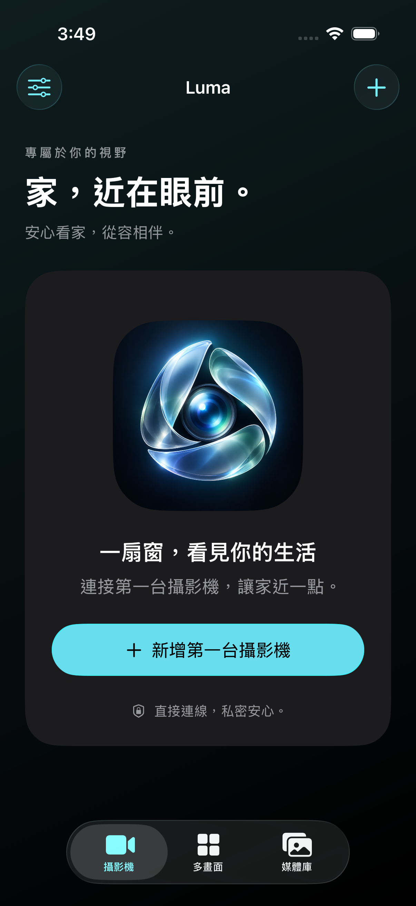
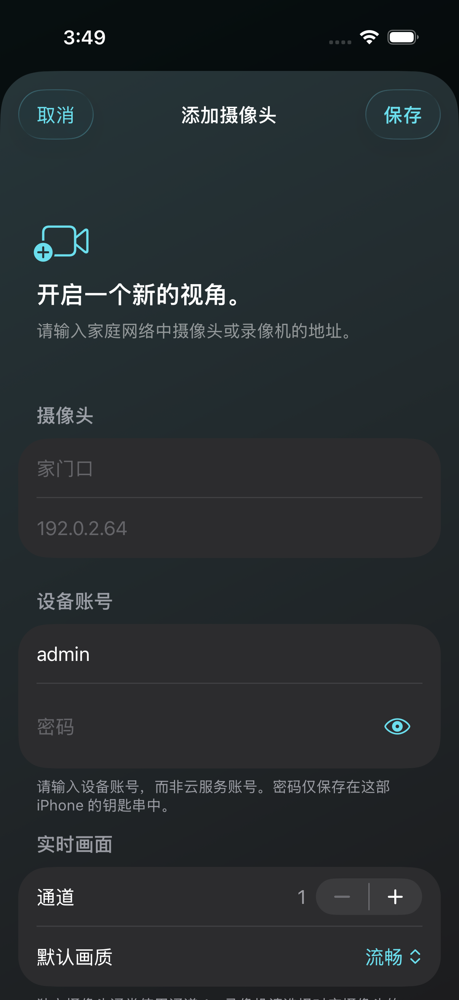
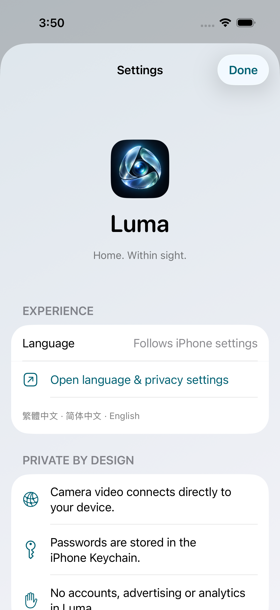

<p align="center">
  
</p>
<h1 align="center">Luma · 流光</h1>
<p align="center"><strong>A clearer view of home.</strong><br>Direct to your cameras. Private on your iPhone.</p>
<p align="center">
  <strong>English</strong> · <a href="README.zh-Hant.md">繁體中文</a> · <a href="README.zh-Hans.md">简体中文</a>
</p>
<p align="center">
  
  
  
  
</p>
<p align="center">
  <a href="#interface-preview">Preview</a> · <a href="#features">Features</a> · <a href="#install-on-an-iphone">Install</a> · <a href="#build-and-validate">Build</a>
</p>

Luma is a local-network camera viewer for **iOS 26 and later**, with native SwiftUI Liquid Glass controls. It connects directly to Hikvision cameras or recorders using RTSP for video and ISAPI for supported PTZ controls.

The app supports **English, Traditional Chinese and Simplified Chinese**. Its Chinese display name is **流光**. This is an early preview: simulator checks do not establish compatibility with every camera or successful installation on a physical iPhone.

Download packages and read the validation scope for each version in [Releases](https://github.com/Jacky-0227/luma/releases). Camera firmware compatibility and physical PTZ movement still require device testing.

## Interface preview

<p align="center">
  
  
  
</p>
<p align="center"><sub>Actual iOS 26 simulator screenshots · No real camera footage or personal device data</sub></p>

<details>
<summary>Custom dashboards · grouping and camera order</summary>
<p align="center">
  
  
</p>
Actual 0.1.2 simulator screens. The synthetic test cameras are offline, so the covers show placeholders.
</details>

<details>
<summary>PTZ controls · offline demonstration</summary>
<p align="center"></p>
The test camera is intentionally offline. This screenshot demonstrates the controls, not a successful connection to a real camera.
</details>

## Features

| Available in this preview | Details |
| --- | --- |
| Live view | Main/sub streams, sound, full screen, fill/fit and bounded reconnect attempts |
| Dashboard | Named groups, camera ordering, 4/8/16 or custom 1–64 views per page, 1–8 columns and snapshot covers; all video keeps its original proportions |
| PTZ | Automatically detects supported pan, tilt and zoom controls; separate web control port |
| Home previews | A local snapshot from the last successful opening identifies each camera; no live stream is opened by the home card |
| Clear navigation | Daily screens use section names; brand messages appear on the first-launch welcome screen |
| Local captures | Snapshots and manual recordings, up to five minutes per recording |
| Media library | Preview snapshots, replay local recordings, export and confirm deletion |
| Configuration backup | Import/export JSON without passwords, snapshots or recordings |
| Appearance and language | Light/dark mode, native Liquid Glass and three localizations |

PTZ detection reads Hikvision capabilities for each axis and supports timed or continuous ISAPI movement. It never moves a camera to detect it. Luma sends Stop when you release, leave the view, enter the background, or reach a two-second hold limit. Continuous control depends on the camera receiving that command; an unconfirmed stop blocks further movement and offers a retry. HTTP controls require Digest authentication, and HTTPS uses system certificate validation. See [PTZ compatibility](docs/PTZ-compatibility.md).

**Not implemented:** automatic camera discovery, PTZ presets, two-way talk, camera SD-card/NVR recording search and playback, picture in picture, widgets and shortcuts. Playback in the media library refers to recordings made by Luma.

Use **Dashboard → +** to name a group, choose cameras and arrange their order. Choose 4, 8, 16 or a custom number of views per page (1–64), and 1–8 columns. The first page forms its cover. All tiles preserve the source aspect ratio with black bars when needed; video is never stretched or squeezed. Covers use small in-memory device snapshots, so devices without a compatible snapshot endpoint show a placeholder. Dashboard layouts stay on this iPhone and are not included in camera configuration exports. Higher live-view counts use more decoding capacity, memory and bandwidth; the configurable limit is not a guarantee of smooth playback on every phone.

Version 0.1.3 adds older Hikvision API/response formats and sends Stop without waiting for an outstanding move response. Its [protocol research map](docs/PTZ-protocol-reference.md) distinguishes implemented ISAPI/IPMD support from ONVIF, PSIA and SDK interfaces that have only been researched.

## Local by design

- No Luma account, cloud sync, remote-access relay, cloud recording or online push service.
- Camera passwords are stored in the device-only Keychain. Camera settings and media directories are excluded from system backups.
- Home previews are captured once after live video starts, stored separately from Library, and retained across launches. They preserve the source proportions and are marked “Last viewed.” Open each camera once to create its first preview; failed playback keeps an existing preview. Changing its connection source or removing the camera invalidates the preview. Preview storage is excluded from backups and configuration exports.
- Exported configuration includes device names, addresses and usernames; it excludes passwords and media. Newly imported cameras require passwords to be entered again. Existing camera IDs are preserved.
- Video pauses when the app enters the background. An active recording is stopped and finalized.
- GitHub Actions builds source code. It does not receive camera settings, video, Apple credentials or signing certificates. Runtime viewing does not require a development computer.

## Install on an iPhone

1. Use an iPhone running iOS 26 or later.
2. Obtain `Luma-unsigned.ipa` from [Releases](https://github.com/Jacky-0227/luma/releases), or extract it from a successful Actions artifact ZIP.
3. On Windows, connect and unlock the iPhone, trust the computer, then open the IPA in [Sideloadly](https://sideloadly.io/).
4. Sign and install with an Apple account locally. Follow the iPhone's prompts for developer trust and Developer Mode.
5. Open Luma, allow Local Network access, connect to the camera's Wi-Fi network, and enter the device address and credentials in the app.

The IPA is unsigned and is not an App Store package. Free-account installation generally needs renewal after seven days; installation and renewal must be verified on the device. Never place Apple passwords or camera credentials in issues, commits or workflow secrets.

In the camera editor, use the RTSP port (usually 554) for video. Luma detects compatible PTZ capabilities automatically without delaying video playback. If needed, change the device's web control port (usually HTTP 80 or HTTPS 443) in Advanced control connection. Start with one sub stream before trying a four-camera dashboard.

## Build and validate

| Component | Version / setting |
| --- | --- |
| Deployment target | iOS 26.0 |
| CI | Standard `macos-15` GitHub runner, Xcode 26.2 |
| Swift | Swift 5 language mode, complete concurrency checking |
| Project generation | XcodeGen 2.46.0 |
| Dependency manager | CocoaPods 1.16.2 |
| Playback | MobileVLCKit 3.7.3, pinned version and archive checksum |
| Bundle identifier | `app.luma.viewer` |

Local resource checks need Python 3:

```sh
python scripts/validate-project.py
```

After forking or cloning to a GitHub repository, a push to `main` triggers CI. GitHub CLI can also start and download a build:

```sh
gh workflow run ios.yml
gh run list --workflow ios.yml --limit 5
gh run download RUN_ID --name Luma-iPhone-unsigned --dir build/download
gh run download RUN_ID --name Luma-test-report --dir build/report
```

Replace `RUN_ID` with the actual run number. Build artifacts expire after **one day**; keep needed downloads locally. Standard runner usage is subject to [GitHub's current Actions billing rules](https://docs.github.com/en/billing/concepts/product-billing/github-actions), especially for private forks.

CI validates metadata and localization, builds the app, runs unit/UI tests and a real VLC integration test using a generated local H.264 clip, then builds an unsigned arm64 iPhone IPA. The integration test captures a snapshot and two consecutive recordings and replays both recordings. A failed test prevents packaging. Test code describes coverage; a particular run's result is the evidence that it passed.

Physical-device validation is still required for camera authentication, codec/audio compatibility, PTZ movement and stopping, network permissions, reconnect behavior, thermal load and sideloading. No live camera footage or credentials are included in this repository.

## Project layout

`Luma/` contains the app, `Tests/` and `UITests/` contain checks, `scripts/` contains the build pipeline, and `design/` contains the app artwork. Xcode projects and dependencies are generated from `project.yml`, `Podfile` and `Podfile.lock`.

See [third-party notices](ThirdPartyNotices.md) for VideoLAN components and artwork provenance. Features were researched using the [IPCams website](https://ipcams.app/), [release notes](https://ipcams.app/changelog/) and [App Store description](https://apps.apple.com/us/app/ip-camera-viewer-ipcams/id1045600272). Luma uses its own name, artwork, interface and implementation.
