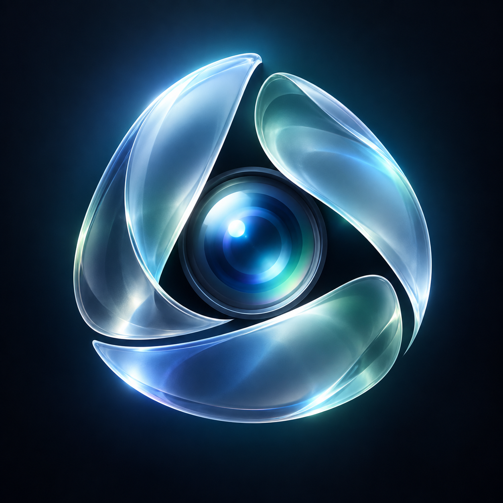
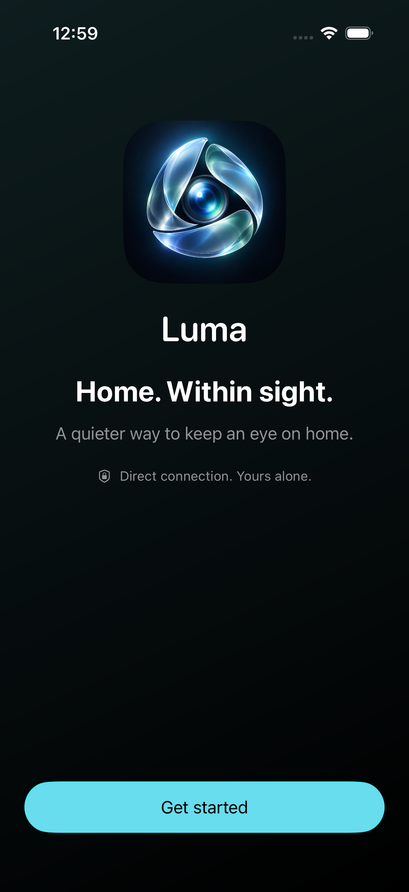
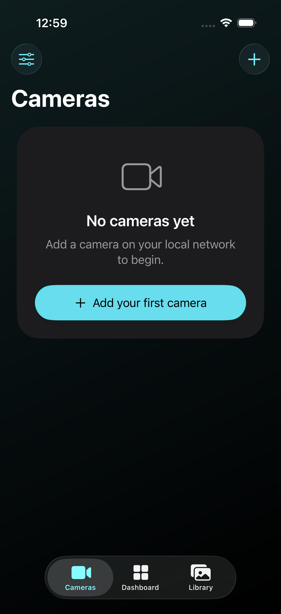
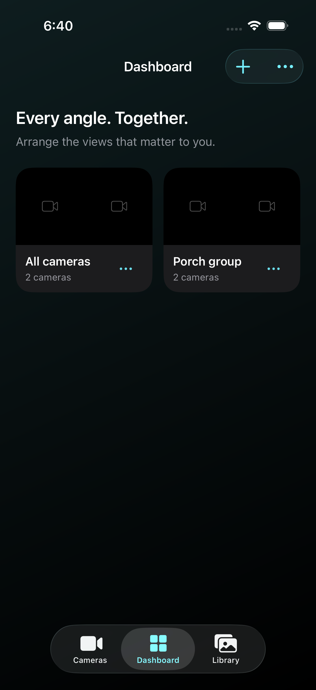
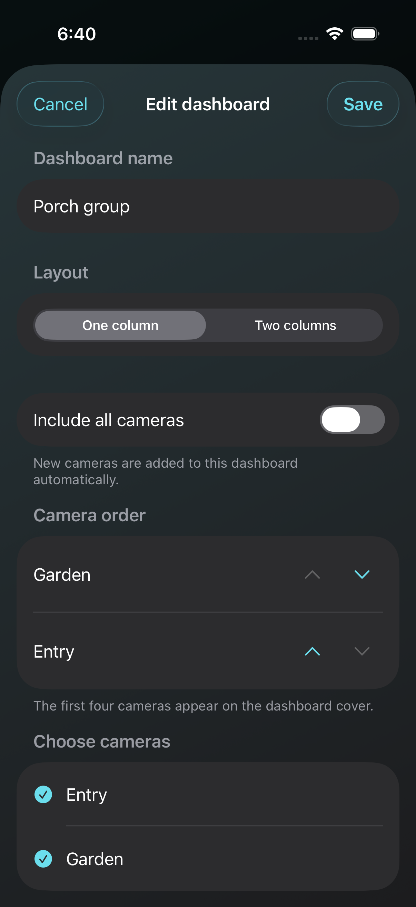
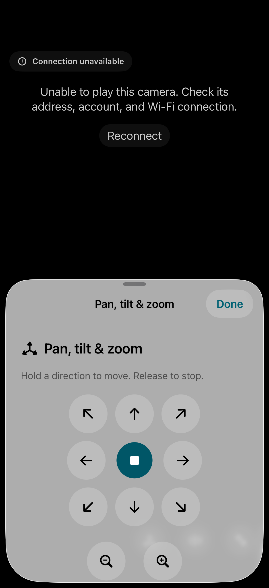

<p align="center">
  
</p>

<h1 align="center">Luma · 流光</h1>

<p align="center">直接連接，安心看見。畫面與密碼留在本機。</p>

<p align="center">
  <a href="README.md">English</a> ·
  <a href="README.zh-Hans.md">简体中文</a> ·
  <a href="README.zh-Hant.md">繁體中文</a>
</p>

<p align="center">
  
  
  
  
</p>

<p align="center">
  <a href="#介面預覽">介面預覽</a> ·
  <a href="#功能">功能</a> ·
  <a href="#在-windows-安裝到-iphone">安裝</a> ·
  <a href="#開發與建置環境">建置</a>
</p>

Luma 是一款面向 **iOS 26 及以上版本**的區域網路攝影機檢視器，使用 SwiftUI 原生 Liquid Glass 介面和 MobileVLCKit 播放 RTSP 串流。App 直接連接同一網路上的攝影機或錄影機，支援繁體中文、簡體中文及英文。

目前為開發預覽版。安裝包及各版本的實際驗證範圍見[版本發布](https://github.com/Jacky-0227/luma/releases)。不同攝影機韌體的相容性、雲台實際移動與效能仍需要真機驗證。

## 介面預覽

<p align="center">
  
  
  
</p>

<p align="center">繁體中文 · 簡體中文 · English</p>

以上為 0.1.3 在 iOS 26 模擬器中的真實截圖，展示首次歡迎頁、攝影機欄目及儀表板。圖片使用英文；應用程式支援三種語言，不含真實攝影機畫面。

<details>
<summary>自訂儀表板 · 分組與攝影機排序</summary>
<p align="center">
  
  
</p>
0.1.3 模擬器實際截圖。測試攝影機處於離線狀態，封面顯示預留圖示，不包含真實監控畫面。
</details>

<details>
<summary>查看雲台控制 · 離線示範</summary>
<p align="center"></p>
測試設備刻意保持離線，圖片用於展示控制介面，不代表已連接真實攝影機。
</details>

## 功能

- **即時畫面**：手動新增攝影機、聲音開關、主／子串流切換、全螢幕及斷線重連。
- **自訂儀表板**：分組命名、攝影機排序、每頁 4／8／16 或自訂 1–64 個畫面、1–8 欄版面及快照封面；所有畫面保持原比例。
- **首頁預覽**：顯示上次開啟並成功播放後的本機靜態快照，標示「上次畫面」；首頁卡片不啟動即時連線。
- **簡潔導覽**：日常頁面使用欄目名稱，品牌標語僅在首次開啟的歡迎頁展示。
- **雲台與變焦**：自動分別偵測各軸能力，支援相容海康 ISAPI 限時與連續控制。放開、離開畫面、進入背景或按住達兩秒時傳送停止指令。
- **截圖與錄影**：播放時儲存截圖或手動錄影；每段錄影最多五分鐘，離開播放頁或進入背景時停止並完成檔案儲存。
- **本機媒體庫**：檢視、播放、匯出及刪除截圖與錄影。錄影容器取決於來源串流及 VLC，不保證一律為 MP4。
- **設定備份**：以 JSON 匯入、匯出攝影機設定，保留既有同 ID 裝置的設定。
- **三語與外觀**：介面及權限說明支援繁體中文、簡體中文及英文，跟隨 iPhone 或個別 App 的語言設定。主頁支援淺色與深色，播放頁使用深色介面。

中文桌面名稱為「流光」，英文為「Luma」。

## 目前的功能邊界

目前以已知 IP 位址手動連接設備，海康 RTSP 路徑可自動產生；其他設備可填寫自訂串流路徑，實際相容性需測試。ISAPI 雲台功能需要設備支援限時或連續移動，且帳號具有雲台控制權限。連續控制需要設備收到停止指令；停止未獲確認時，會暫停新的移動並提示重試。偵測過程不會移動攝影機。詳見[雲台相容說明](docs/PTZ-compatibility.md)。

在「儀表板 → +」中自訂名稱、選擇攝影機及排列順序。每頁可選 4、8、16 或自訂 1–64 個畫面，欄數可選 1–8。第一頁的攝影機組成封面；所有畫面按原比例縮放，空餘位置留黑邊，不拉長、壓縮或裁切。封面使用記憶體中的小型設備快照，不支援快照介面時顯示預留圖示。分組儲存在本機，暫不包含在設備設定匯出中。更多即時畫面會增加解碼、記憶體及頻寬需求；可設定上限不代表每台手機都能流暢播放對應數量。

0.1.4 將即時儀表板改為純畫面牆：16:9 格位、窄間距，不顯示攝影機名稱及狀態底欄；影像依原比例完整顯示。單路觀看使用 100 毫秒網路緩衝並限制額外時鐘補償，多畫面仍保留 500 毫秒緩衝。即時畫面開啟時，以唯讀狀態查詢預先建立雲台控制連線；移動與停止不會等待預熱。以上屬於播放與控制最佳化，並非端到端延遲保證。

全螢幕時可雙指縮放至 6 倍，放大後拖動檢視，點選 **1×** 恢復完整畫面。電子放大保持原比例，沿用目前的視訊連線，不驅動雲台，也不改變原始快照與錄影。離開全螢幕或旋轉手機時恢復原始倍率。

0.1.3 補充舊版海康介面與回應格式，停止指令不再等待移動請求返回。[雲台協定資料](docs/PTZ-protocol-reference.md)區分已實作的 ISAPI／IPMD 相容，以及已研究但尚未實作的 ONVIF、PSIA 和 SDK 介面。

首頁預覽在成功出畫面後自動擷取一次，與媒體庫分開儲存，重啟應用程式仍保留，並按原比例顯示。首次使用需開啟對應攝影機一次；連線失敗時保留舊圖。更改連線來源或刪除攝影機會使對應預覽失效。預覽只儲存在手機本機，不包含在系統備份或設定匯出中。

以下功能尚未實作：

- 攝影機 SD 卡／NVR 歷史錄影的查詢與回放。
- 雙向對講、雲台預設位置、系統畫中畫（PiP）。
- ONVIF 或其他自動探索設備方式。
- 小工具及捷徑。

App 不提供雲端帳號、雲端同步、雲端中繼、遠端穿透、常駐錄影或線上推播。媒體庫回看的是 Luma 在手機內手動錄製的檔案。

## 資料與隱私

攝影機設定及媒體檔案儲存在手機本機，相關目錄不參與系統雲端備份。設備密碼獨立存於 iPhone 鑰匙圈，限本機解鎖時存取，未啟用鑰匙圈同步。

設定備份包含設備名稱、位址、使用者名稱及連線選項，**不包含密碼、截圖或錄影**。新增匯入的攝影機需要重新填寫密碼；重複匯入不會覆蓋既有攝影機的設定與密碼。手動匯出時，存放位置由使用者選擇。

GitHub Actions 僅處理原始碼、合成測試資料及建置產物，不需要攝影機或 Apple 帳號密碼。請勿將真實設備設定、含密碼的 RTSP 網址、Apple 憑證或簽名檔案提交至儲存庫。

## 開發與建置環境

Windows 可用於編輯程式碼及操作 GitHub Actions；iOS 編譯與模擬器測試在 macOS 執行。亦可在具備相同工具的 Mac 建置專案。

| 項目 | 專案設定 |
| --- | --- |
| 最低系統 | iOS 26.0 |
| GitHub 執行器 | `macos-15` 標準執行器 |
| Xcode | 26.2 |
| Swift | Swift 5 語言模式，完整並行檢查 |
| XcodeGen | 2.46.0 |
| CocoaPods | 1.16.2 |
| MobileVLCKit | 3.7.3 |
| 公開版 Bundle ID | `app.luma.viewer` |

XcodeGen 依 [project.yml](project.yml) 產生 Xcode 專案，CocoaPods 產生工作區。播放元件版本由 [Podfile](Podfile) 與 [Podfile.lock](Podfile.lock) 固定。工具及播放元件下載包會核對雜湊值；執行器映像與間接工具依賴仍可能更新。

Windows 上安裝 Python 3 後，可先在專案目錄執行資源檢查：

```powershell
python scripts/validate-project.py
```

此檢查涵蓋權限文案、三語資源、格式佔位符及圖示引用。Swift 編譯與模擬器測試由 macOS 工作流程執行。

在安裝 Xcode 26.2 的 Mac 上，可準備工具與相依元件後開啟產生的工作區：

```sh
bash scripts/ci-bootstrap.sh
open Luma.xcworkspace
```

## 使用 GitHub Actions 產生 IPA

將專案放入 GitHub 儲存庫並啟用 Actions。在儲存庫頁面選擇 **Actions → Build Luma for iPhone → Run workflow**，選取分支後按 **Run workflow**。工作流程亦會在 `main` 的相關程式碼變更推送後執行。

已安裝並登入 GitHub CLI 時，可在儲存庫目錄操作：

```powershell
gh workflow run ios.yml
gh run list --workflow ios.yml --limit 5
gh run view RUN_ID
```

將 `RUN_ID` 換成該次執行的 ID。**待測試及打包成功**，再下載產物：

```powershell
gh run download RUN_ID --name Luma-iPhone-unsigned --dir build/download
gh run download RUN_ID --name Luma-test-report --dir build/report
```

也可從該次 Actions 執行頁面的 **Artifacts** 區域下載。網頁下載的產物需先解壓縮，取得 `Luma-unsigned.ipa`。

工作流程依序檢查資源、準備固定版本工具、執行 iOS 26 模擬器測試，再建立 arm64 真機 Release。只有測試與封裝檢查成功才會提供 IPA。產物包含未簽名安裝包與精簡診斷資料，保留一天；單次工作流程最多執行 35 分鐘。

原始碼提交 `3e14938` 的 38 項自動化測試全部通過，涵蓋模型、設定備份、雲台指令、媒體儲存、真實 VLC 元件擷取／回放及三語介面流程。後續版本請查看對應 Actions 執行結果；真機驗收仍待完成。

## 在 Windows 安裝到 iPhone

準備執行 iOS 26 或更新版本的 iPhone、可傳輸資料的連接線、Apple 帳號，以及 [Sideloadly](https://sideloadly.io/) 要求的 Windows Apple 驅動與相依元件。

1. 取得成功建置的 `Luma-unsigned.ipa`。
2. 用連接線連接 iPhone，解鎖手機並選擇「信任此電腦」。
3. 在 Sideloadly 選擇 iPhone 和 IPA，以 Apple 帳號完成簽名及安裝。
4. 按 iPhone 的提示信任開發者，並開啟開發者模式。
5. 讓手機連接攝影機所在的 Wi-Fi，開啟 Luma 並允許「區域網路」權限。
6. 新增設備，填寫 IP 位址、RTSP 連接埠、通道、設備使用者名稱及密碼。

依 [Sideloadly 官方說明](https://sideloadly.io/)，免費 Apple 帳號側載通常需要每七天重新簽名；實際安裝、啟動及續簽結果須透過手機與簽名工具驗證。正常觀看攝影機時，Windows 電腦與 GitHub 建置服務不參與影像傳輸。

Luma 會自動讀取設備的雲台能力與通道對應，支援時顯示控制，不需手動開啟，也不會等待辨識完成才播放。設備的網頁連接埠通常為 HTTP `80` 或 HTTPS `443`，如有變更可在「進階控制連線」調整。HTTP 控制採用 Digest 驗證；HTTPS 保留系統憑證驗證，需要受信任的設備憑證。

## 真機驗證

模擬器使用合成資料，不會連接真實攝影機。首次安裝後，請先驗證一路子串流，再檢查主串流、聲音、四畫面、雲台放開停止、截圖、錄影收尾及媒體庫回放。亦應確認區域網路權限、Wi-Fi 中斷後重連、背景切換、橫豎螢幕、常用文字大小及長時間播放的溫度與耗電。

專案使用標準 GitHub 託管執行器。公開儲存庫的適用免費條件，以及私人儲存庫的分鐘數與儲存額度，請以 [GitHub Actions 計費說明](https://docs.github.com/en/billing/concepts/product-billing/github-actions) 為準。

## 專案結構

| 路徑 | 用途 |
| --- | --- |
| `Luma/` | SwiftUI 介面、播放、設備設定與本機儲存 |
| `Luma/Resources/` | 三語文案及權限說明 |
| `Luma/Assets.xcassets/` | 圖示與色彩資源 |
| `Tests/`、`UITests/` | 核心、元件整合與介面測試 |
| `.github/workflows/ios.yml` | 雲端建置工作流程 |
| `scripts/` | 工具準備、資源檢查、測試及 IPA 驗證 |
| `design/` | 圖示設計資源 |

## 元件與授權說明

Luma 使用 VideoLAN 的 MobileVLCKit。相關版本、上游原始碼及授權說明列於 [ThirdPartyNotices.md](ThirdPartyNotices.md)。圖示為本專案生成的原創設計，來源說明見 [圖像聲明](design/ARTWORK.md)。

- [Apple Liquid Glass 文件](https://developer.apple.com/documentation/technologyoverviews/liquid-glass)
- [VideoLAN VLCKit](https://code.videolan.org/videolan/VLCKit)
- [XcodeGen](https://github.com/yonaskolb/XcodeGen)
- [Sideloadly](https://sideloadly.io/)
