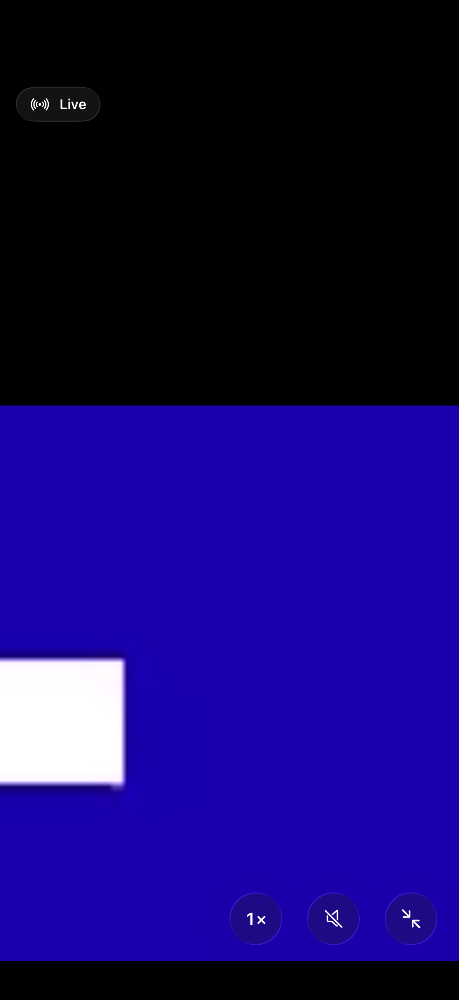
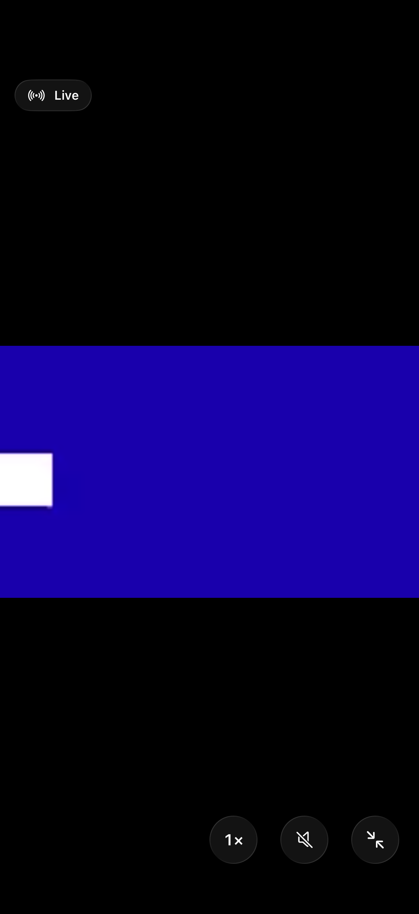

# Luma 0.1.4 · validation / 驗證 / 验证

Version **0.1.4 (5)** · iOS **26+** · Xcode **26.2**

Packaged source: `3669c3f9e3d381c296f97bd49740413b9d2e6ddf`.

IPA SHA-256: `6ab62c16a4bbd125375b9ca108c736804fe7357d244a22aae9823eca8b8c6de0`.

The downloaded archive passed ZIP integrity and package validation: version 0.1.4, build 5, `app.luma.viewer`, arm64, iOS 26 minimum, and all three language resources.

## English

Validation was collected across separate simulator runs, rather than one successful full-suite run:

| Scope | Evidence |
| --- | --- |
| PTZ discovery, Digest authentication, independent Stop, touch events; camera storage/backup, dashboard storage/sessions/previews, thumbnails; dashboard and welcome UI | 119 checks passed on `7cfc289` (run `37117085442`, excluding its viewer tests) |
| Native zoom limits, rotation/reset, accessibility; real RTSP authentication/decoding, delayed setup, cancellation, wrong password; real VLC preview, snapshot and two replayable recordings | All 8 viewer integration checks passed on `8a47305` (run `37118054176`) |
| Full-screen pinch, pan, 1× reset, exit/reset and uninterrupted RTSP connection while frames continue arriving | UI test passed on `7fc8dac` (run `37118727741`) |

The release's application files, project settings, dependencies and packaging script are byte-identical to `8a47305`. The later changes affect test fixtures and manual packaging only. Subsequent to the baseline run, application changes were confined to the player status accessibility label and address-free capture diagnostics; PTZ and dashboard code stayed unchanged.

The last viewer run passed the gesture test but failed one RTSP test while preparing a temporary test movie, before opening a player. That RTSP test had passed in the preceding viewer run. Explicit temporary-directory creation was added afterward; this final fixture correction was **not rerun**. Run `37119504559` built the unsigned device IPA with `package_only=true` and did **not** run tests. Its successful status describes packaging, not a full test pass.

Screenshots below show a generated moving square transmitted over loopback RTSP, not camera footage. Zoom changes the display transform; saved images and recordings retain their source proportions. Physical camera response, Wi-Fi variability and signed installation still require device testing. The 100 ms buffering setting is not an end-to-end latency measurement.

## 繁體中文

本版驗證分多輪完成，並非單次完整測試全數通過。雲台、儲存與備份、儀表板及初次啟動介面共 119 項檢查通過；8 項縮放、真實 RTSP 解碼與 VLC 擷取整合檢查在後續一輪全數通過；持續送出影格時的雙指縮放、拖動、1× 恢復、退出全螢幕及不重新連線檢查也已通過。

最後一輪有一項 RTSP 測試在建立臨時測試影片時失敗，尚未開啟播放器；同一項目在前一輪已通過。已補上臨時目錄建立，但該測試輔助修正未再次執行。最終打包工作只編譯與驗證 IPA，沒有重跑測試；成功狀態不代表完整測試全綠。應用程式原始碼、專案設定、相依套件與打包腳本均與已測試的 `8a47305` 相同。

下圖為合成方塊測試影片，不含真實攝影機畫面。實際雲台反應、Wi-Fi 波動與簽名安裝仍需真機驗證；100 毫秒緩衝設定不等於端到端延遲。

## 简体中文

本版验证分多轮完成，并非单次完整测试全部通过。云台、存储与备份、仪表盘及首次启动界面共 119 项检查通过；8 项缩放、真实 RTSP 解码与 VLC 截取整合检查在后续一轮全部通过；持续发送视频帧时的双指缩放、拖动、1× 恢复、退出全屏及不重新连接检查也已通过。

最后一轮有一项 RTSP 测试在创建临时测试影片时失败，尚未打开播放器；同一项目在前一轮已通过。已补上临时目录创建，但该测试辅助修正未再次执行。最终打包任务只编译与验证 IPA，没有重跑测试；成功状态不代表完整测试全绿。应用源代码、项目设置、依赖与打包脚本均与已测试的 `8a47305` 相同。

下图为合成方块测试影片，不含真实摄像头画面。实际云台响应、Wi-Fi 波动与签名安装仍需真机验证；100 毫秒缓冲设置不等于端到端延迟。

## Gesture screenshots / 手勢截圖 / 手势截图

<table>
  <tr><th>Magnified + panned / 放大並拖動 / 放大并拖动</th><th>Reset to 1× / 恢復 1× / 恢复 1×</th></tr>
  <tr>
    <td></td>
    <td></td>
  </tr>
</table>
